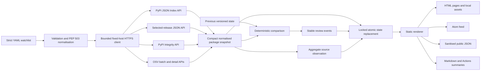

# Architecture

## Design goals

DistWitness is local-first, deterministic, static, bounded, and fail-closed.
The collection plane contacts fixed public APIs; the publication plane consists
only of generated files.

## Module boundaries

- `config.py` safely parses YAML and enforces the closed configuration schema.
- `models.py` owns versioned Pydantic contracts.
- `normalise.py` handles package names, dependency declarations, URLs, bounded
  strings, and deterministic collections.
- `http.py` is the only general transport surface. It accepts only HTTPS,
  allowlisted hosts, GET/POST, bounded redirects, and bounded JSON.
- `pypi.py` discovers versions through the JSON Index API, retrieves only
  selected-release JSON and Integrity records, and never consumes distribution
  download URLs or the deprecated project JSON `releases` field.
- `osv.py` handles exact-version batch order, per-query pagination, bounded
  detail reads, and compact advisory metadata.
- `compare.py` canonicalises evidence into stable events.
- `storage.py` migrates known historical schema versions in memory, then
  validates, locks, prunes, deduplicates, and atomically replaces state without
  resetting corrupt files. Event and source-health retention remain separately
  bounded.
- `render.py` and `feed.py` generate escaped static outputs, including bounded
  20-event archive pages with deterministic nearby-page navigation.
- `runner.py` preserves prior data across partial-source failures and records
  one aggregate package-check observation per source and persisted run.
- `cli.py` defines command/exit contracts and emits summaries.

## Determinism

Package names, fields, files, advisories, links, and events are sorted before
serialisation. JSON contracts use explicit schema versions, sorted keys, UTF-8,
and compact separators for private state. Event IDs hash canonical evidence
excluding the detection time, so repeating identical inputs cannot create
duplicates. Version and migration details are in
[`STATE_SCHEMA.md`](STATE_SCHEMA.md).

## Completeness and failure

A PyPI failure prevents a fresh snapshot for that package and preserves the
previous one. An OSV failure is attached to the new snapshot and prevents
advisory comparison; a prior exact-version advisory set may be retained. Failed
or unavailable provenance is displayed but cannot become “absent.” Malformed
saved state fails with the original file preserved. Unsupported Index API major
versions fail closed; newer v1 minor versions warn and use only the known
contract.

Source-health observations are ordered by completion time and source, deduped by
that pair, pruned to the configured retention window, and capped at 1,000 run
groups. Public summaries report exact counts and label fewer than seven
observations as a baseline rather than mature operational history.

## Deployment trust boundary

CI has read-only contents permission and uses fixture data. The scheduled
collection job also has read-only contents permission, restores and refreshes a
workflow cache containing compact state, and produces a site artefact. The cache
is operational continuity rather than confidential storage and never contains
secrets or raw responses. A separate deployment job has `pages: write` and
`id-token: write` without repository write permission, receives only generated
public files, and deploys through the protected `github-pages` environment. The
Pages artefact contains no state, source, or workflow files.
